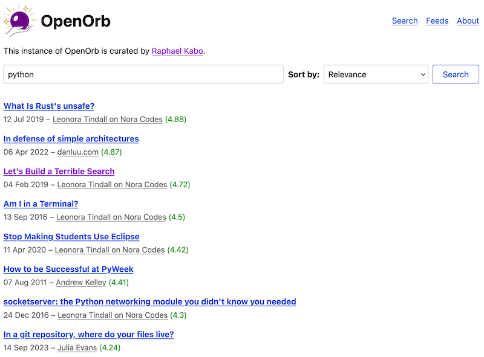

# OpenOrb

OpenOrb is a curated search engine for Atom and RSS feeds. You can use my own instance [here](https://openorb.idiot.sh).



An OpenOrb instance is configured with a list of feeds to search - what was once called a blogroll - and indexes this list periodically. In this way, OpenOrb provides a window into the content a specific person or community cares about, with the benefit of making this content searchable and therefore more accessible. OpenOrb is designed to be the opposite of Google and other black box, monolithic search engines - it's open source, configurable, personal, and predictable.

OpenOrb uses an extremely simple search engine, mostly adapted from [Alex Molas's superb 'search engine in 80 lines of Python'](https://www.alexmolas.com/2024/02/05/a-search-engine-in-80-lines.html), which uses [BM25](https://en.wikipedia.org/wiki/Okapi_BM25) and doesn't handle wildcards, boolean operators, or stemming/lemmatization (yet). I might add some of these features in the future, but I wrote OpenOrb in a single day so I'm keeping it simple for now!

The success of a search on OpenOrb suffers from the same limitations as RSS in general - people and software have different, and sometimes weird, opinions on how to present structured data. If a feed [doesn't include full post content](https://nora.codes/post/adding-full-post-content-to-my-rss-feed/) (which it should!), then OpenOrb won't be able to index it. If a feed has a cut-off limit for how many posts are in it, OpenOrb will only know about the ones that it had time to save. Embrace the limitations of the messy open web, and tell your friends to stop deleting posts from their feeds.

## Setup

OpenOrb can be run as a Docker Compose stack. First, clone the repo:

```
git clone https://git.sr.ht/~lown/openorb
cd openorb
```

In the `data` folder, rename the `config.example.toml` file to a `config.toml` file and edit it to your liking. Start OpenOrb by running:

```
docker compose up -d
```

OpenOrb will save its `index.db` SQLite database in the `data` folder. If you edit the config file, restart the stack by running the same command.